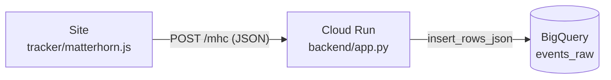

# Matterhorn

Coleta de eventos web própria, no estilo do GA4 e do Mixpanel, rodando no seu
projeto do Google Cloud. Um script no site envia os eventos para um serviço no
Cloud Run, que grava cada um no BigQuery com o mesmo formato de `event_params`
do export do GA4.


Esta é a primeira versão: um endpoint, uma tabela e o mínimo de
infraestrutura para colocar a coleta no ar.

A documentação completa, com o passo a passo de implantação, referência da API
e exemplos de consulta, fica em [`docs/index.html`](docs/index.html).

## Como funciona



1. O `matterhorn.js` monta o evento com o contexto da página (URL, título,
   navegador, dispositivo e idioma) e faz um `POST` em `/mhc`.
2. O `app.py` transforma `event_params` de objeto simples na lista tipada do
   GA4 e insere a linha no BigQuery por streaming.
3. Dataset, tabela, service account, serviço no Cloud Run e permissões são
   criados pelo Terraform em `infra/`.

## Estrutura do repositório

```
.
├── backend/                 Serviço de coleta (Flask + gunicorn)
│   ├── app.py
│   ├── Dockerfile
│   └── requirements.txt
├── tracker/
│   └── matterhorn.js        Script instalado no site
├── infra/                   Terraform
│   ├── versions.tf          Versões do Terraform e do provider
│   ├── providers.tf
│   ├── variables.tf         Todas as entradas, com padrão e descrição
│   ├── bigquery.tf          Dataset e tabela
│   ├── iam.tf               Service account e acesso ao BigQuery
│   ├── cloud_run.tf         Serviço e acesso público
│   ├── outputs.tf
│   ├── schemas/
│   │   └── events_raw.json  Esquema da tabela
│   └── terraform.tfvars.example
└── docs/
    └── index.html           Documentação completa
```

## Pré-requisitos

- Projeto no Google Cloud com faturamento ativo.
- [Google Cloud CLI](https://cloud.google.com/sdk/docs/install) e
  [Terraform](https://developer.hashicorp.com/terraform/install) 1.5 ou mais
  novo. No Windows, use o WSL2; a instalação está no guia em `docs/`.
- Docker local não é necessário. A imagem é gerada no Cloud Build.

## Implantação

Troque `SEU_PROJETO` pelo ID do seu projeto. Os comandos usam a região
`us-central1`.

**1. Autenticar e habilitar as APIs**

```bash
gcloud auth login
gcloud auth application-default login
gcloud config set project SEU_PROJETO

gcloud services enable run.googleapis.com artifactregistry.googleapis.com \
  cloudbuild.googleapis.com iam.googleapis.com bigquery.googleapis.com
```

**2. Criar o repositório de imagens e gerar a primeira versão**

```bash
gcloud artifacts repositories create matterhorn-repo \
  --repository-format=docker --location=us-central1

gcloud builds submit backend \
  --tag us-central1-docker.pkg.dev/SEU_PROJETO/matterhorn-repo/matterhorn-api:v1
```

**3. Criar a infraestrutura**

```bash
cd infra
cp terraform.tfvars.example terraform.tfvars   # preencha project_id e image_tag
terraform init
terraform plan
terraform apply
```

No fim, o Terraform imprime os outputs. O `collector_endpoint` é a URL que o
tracker precisa.

**4. Instalar o tracker**

Em `tracker/matterhorn.js`, troque o valor de `ENDPOINT` pelo
`collector_endpoint` e carregue o script nas páginas, direto no HTML ou numa
tag de HTML personalizado do Google Tag Manager. O `page_view` sai assim que o
script carrega. Para eventos próprios:

```js
matterhorn_event("add_to_cart", { item_id: "SKU-123", price: 49.9, currency: "BRL" });
```

## Dados no BigQuery

Cada evento é uma linha em `events_raw`. Os parâmetros ficam em
`event_params`, um `RECORD REPEATED` de `key` e
`value.{string_value, int_value, double_value}`, como no export do GA4.

| Valor enviado      | Coluna preenchida                       |
| ------------------ | --------------------------------------- |
| inteiro (`3`)      | `int_value`                             |
| decimal (`49.9`)   | `double_value`                          |
| texto              | `string_value`                          |
| booleano           | `string_value`, como `"true"`/`"false"` |
| objeto ou lista    | `string_value`, serializado em JSON     |
| `null`             | nenhuma                                 |

O JavaScript não diferencia `50` de `50.0`, então um preço redondo chega como
inteiro. Para valores numéricos, leia as duas colunas:

```sql
SELECT
  (SELECT value.string_value FROM UNNEST(event_params) WHERE key = 'item_id') AS item_id,
  (SELECT COALESCE(value.double_value, value.int_value)
     FROM UNNEST(event_params) WHERE key = 'price') AS price
FROM `SEU_PROJETO.matterhorn_dataset.events_raw`
WHERE event_name = 'add_to_cart';
```

O `timestamp` está em milissegundos. Use `TIMESTAMP_MILLIS(timestamp)` para
converter.

## Publicar uma nova versão do backend

```bash
gcloud builds submit backend \
  --tag us-central1-docker.pkg.dev/SEU_PROJETO/matterhorn-repo/matterhorn-api:v2
```

Depois, atualize `image_tag` em `infra/terraform.tfvars` e rode
`terraform apply`. Um `gcloud run deploy` também funciona para um teste
rápido, mas o próximo `apply` devolve o serviço para a tag do `tfvars`.

Para acompanhar os logs:

```bash
gcloud run services logs read matterhorn-backend --region us-central1 --limit 50
```

## Limitações conhecidas

- O endpoint é público. Qualquer pessoa com a URL consegue gravar eventos; o
  `max_instance_count` limita o custo, mas não filtra origem.
- O `timestamp` vem do relógio do visitante. Não há horário de recebimento no
  servidor.
- A tabela não é particionada. Com volume alto, cada consulta lê a tabela
  inteira, e particionar depois exige recriá-la.
- `os` guarda o `navigator.platform` bruto (`Win32`, `MacIntel`, `iPhone`).
- O envio usa XHR assíncrono. Um evento disparado no instante em que o
  visitante sai da página pode se perder.
